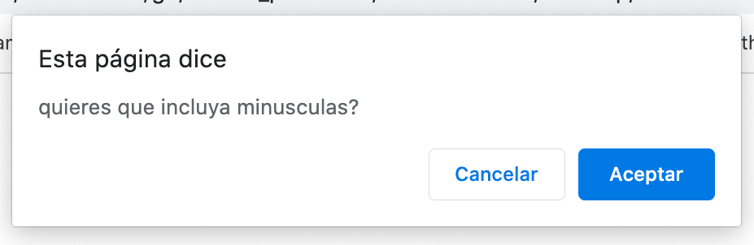

# secure_password
make a random secure password

# UNIT 03 JavaScript: Password Generator

##  Task
```
AS AN employee with access to sensitive data
I WANT to randomly generate a password that meets certain criteria
SO THAT I can create a strong password that provides greater security
```


## Process

```
FOR generate a secure password
WHEN I click the button to generate a password
THEN I am presented with a series of prompts for password criteria
WHEN prompted for password criteria
THEN I select which criteria to include in the password
WHEN prompted for the length of the password
THEN I choose a length of at least 8 characters and no more than 128 characters
WHEN prompted for character types to include in the password
THEN I choose lowercase, uppercase, numeric, and/or special characters
WHEN I should answer each prompt, must accept at least one character type
THEN my input should be validated
THEN a password is generated that matches the selected criteria
WHEN the password is generated
THEN the password is written to the page
```

## The application

The following images shows the web application's series of prompts, appearance and functionality in order to obtain the password:
1.
;

2.
;

3.
;

4.
;

5.
;

6.
;

7.
;


## Credits 

To solve the needs to this subject, I use the following pages 
- https://www.w3schools.com/
- https://www.dyn-web.com/
- https://developer.mozilla.org

## Challenge

It was very difficult for me, because I am beginning to understand how to code, and javascript is certainly a challenge

## Contributing
- https://github.com/AlheliMi/secure_password.git
-  https://alhelimi.github.io/secure_password/.


